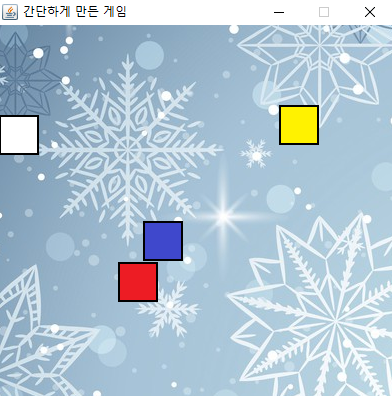

# 간단하게 만든 게임
2019년 크리스마스에 집에서 하루동안 만든 게임입니다.

## 설명

플레이어의 캐릭터가 적과 접촉하지 않게하면서 오래 버티는 게임입니다.

게임 오버시 플레이어가 몇 초 동안 버텼는지 표시됩니다.

### 플레이어 캐릭터

플레이어는 이 하얀 네모를 방향키로 움직여서 다른 네모와 접촉하지 않고 오래 버텨야합니다.

### 적

적은 빨주노초파남보의 총 7가지 네모가 있습니다.

5초를 버틸 때마다 아직 출현하지 않은 네모 중 무작위로 하나가 출현합니다.

단, 맨 처음 나오는 네모는 빨강으로 고정입니다.

빨강

플레이어를 일정한 속도로 계속 따라갑니다.

주황

사방으로 진동하며 무작위 방향으로 이동합니다.

노랑

잠시 부들부들 떤 후 그 때 플레이어가 있던 위치로 순식간에 돌진합니다.

초록

게임 화면의 특정한 네 지점을 시계방향으로 이동합니다.

파랑

빨강과 동일한 방법으로 이동하지만 주기적으로 흐릿해집니다.

남색

벽에 닿을 때마다 불규칙하게 튕겨져 나옵니다.

보라

두 가지 이동 방법을 차례대로 수행합니다.

1. 게임 화면의 상/하 밖의 무작위 위치에서 게임 화면의 하/상 방향으로의 일직선 이동을 합니다.

2. 게임 화면의 좌/우 밖의 무작위 위치에서 게임 화면의 우/좌 방향으로의 일직선 이동을 합니다.
